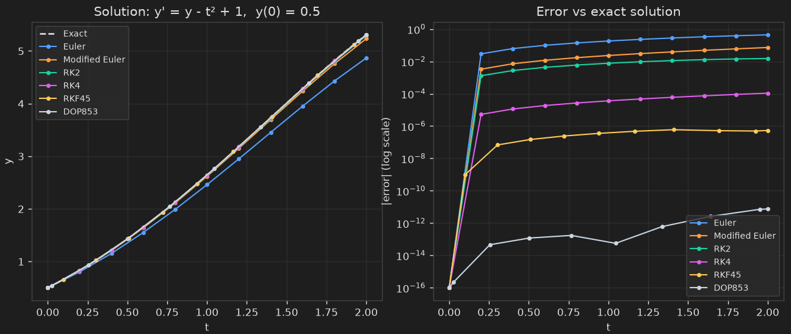

# ODE Solvers Comparison

A from-scratch implementation and comparison of six numerical methods for
solving ordinary differential equations:

- **Euler method** — explicit forward Euler (1st order)
- **Modified Euler method** — Heun's predictor-corrector (2nd order)
- **RK2** — midpoint method (2nd order)
- **RK4** — classic 4-stage Runge-Kutta (4th order)
- **RKF45** — Runge-Kutta-Fehlberg, embedded 4th/5th order with adaptive
  step size
- **DOP853** — Dormand-Prince 8th order, adaptive (via
  `scipy.integrate.solve_ivp`, since its ~13-stage Butcher tableau isn't
  practical to hand-code)

All six solvers are run on the same test problem, and their accuracy is
compared against the known closed-form solution.

## Output



*Left: the six numerical solutions vs. the exact solution. Right: each
method's error over time on a log scale — DOP853 stays near machine
precision (~10⁻¹⁴), while Euler's error grows to nearly 1.*

## Features

- Each method implemented as its own function with a shared signature
  (`solver(f, t0, y0, t_end, h)`), so any of them can be dropped into a
  different ODE or system of ODEs
- Works for both scalar and vector-valued `y`, since state is handled as a
  NumPy array internally
- Adaptive step-size control for RKF45, implemented from the classic
  Fehlberg coefficients (Butcher tableau)
- Side-by-side accuracy comparison: a results table (final value, error,
  steps used) plus solution and error-vs-time plots

## Requirements

- Python 3.9+
- See `requirements.txt`

## Setup

```bash
git clone https://github.com/linkedaven/Differential-Equation-Solver.git
cd Differential-Equation-Solver
pip install -r requirements.txt
```

## Usage

```bash
python ode_solvers.py
```

A window opens showing the six numerical solutions against the exact
solution (left) and each method's error on a log scale (right). The four
fixed-step methods (Euler, Modified Euler, RK2, RK4) use a step size of
`h = 0.2`; RKF45 runs adaptively with `tol = 1e-6`; DOP853 runs with
`rtol = 1e-10` and `atol = 1e-12`.

## Test problem

By default, the script solves:

```
y' = y - t² + 1,    y(0) = 0.5,    t ∈ [0, 2]
```

whose closed-form solution is:

```
y(t) = (t + 1)² - 0.5·eᵗ
```

To try a different problem, edit `f(t, y)`, `y_exact(t)`, and the values of
`t0`, `y0`, and `t_end` near the top of `ode_solvers.py`. Since every solver
shares the same signature, the rest of the script works unchanged. To
change the step size of the fixed-step methods, edit `h` in the comparison
section at the bottom of the script.

## License

MIT — see [LICENSE](LICENSE).
